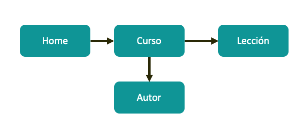

# Documental - Module 1 - MongoDB Data Modelling
1. [Introduction](#introduction)
2. [Application Sitemap](#sitemap)
3. [Workload](#workload)
4. [Useful links](#links)
   

## 1. Introduction
This repository presents the data modeling solution for the following requirements given by the Bootcamp Backend Lemoncode for the Module 1 - MongoDB Data Modelling.

A technology startup is going to develop an ELearning portal and they asked us to model it.
* It will be a portal within the software development field.
* The portal does have courses, each course does have a number of lectures. Each Lecture does have an article.
* The course's webpage should display the list of authors per course.
* The lecture's webpage should display the author of the lecture.
* The lectures and the content of each article are stored in a storage S3 and a headless CMS, in the database only stored the Id's to those resources.
* The lectures can be classified by category (Devops / Front End / Back End / ...)
* A lecture has an author, a course can have more than one authors.
* You could display the author's biography web page, but it is not frequently visited.

## 2. Application Sitemap 

## 3. Workload
* There is main page that shows the last five lectures published from each category (Front End, Backend, Devops), where we could delegate to cache the page into the web server.
* The web page that shows the course details will be displayed a lot.
* The lecture's webpage will be displayed a lot.
* The author's webpage it is not frequently visited.

Volume (size) data:

* Categories: Initially 4, Front End, Devops, Backend, Others (it might be extended: Movile Development, IA, Blockchain...).
* Courses: Initially 10, it is estimated to be 100 in one year and maximum 1000 in five years.
* Lectures per course: A course will have between 1 and 20 lectures maximum.
* File for a specific course:
  * The text that describes the file of the course will be stored as a external resource to the Database, Mongo only will store a GUID that identifies that content.
  * The lectures will be stored in a CDN, the database only needs to know the GUID of the lecture or URL.

* Write:
  * It is not expected to upload more than one or two courses / lectures per day.
  * It is expected that one author is created once a day as maximum.
* Read:
  * It is expected a read extensive workload in main page and lectures.
  * A similar webpage would be https://www.lemoncode.tv/

## 4. Useful links
https://www.mongodb.com/developer/products/mongodb/mongodb-schema-design-best-practices/
