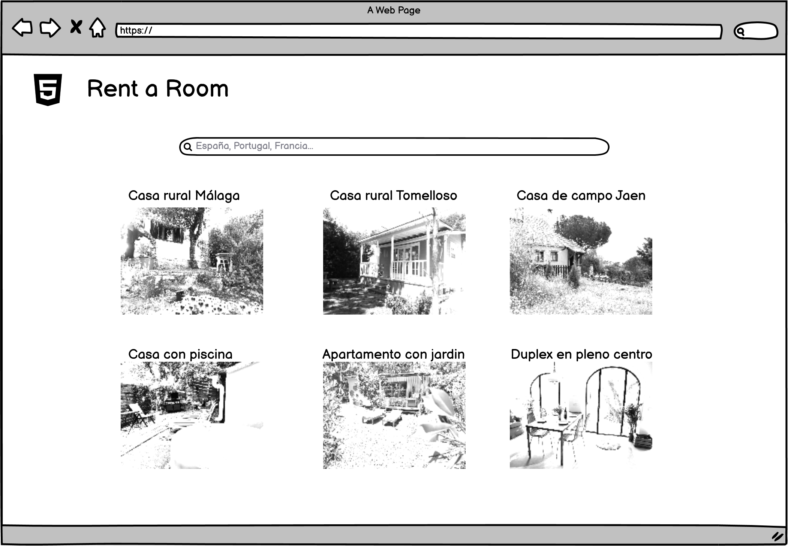

# Table of Contents
1. [Introduction](#introduction)
2. [Requirements](#requirements)

## 1. Introduction
This repository presents the solution to the exercise provided by the Bootcamp Backend Lemoncode for the [Module 4 - Rest Api](https://github.com/Lemoncode/bootcamp-backend/tree/main/00-stack-documental/04-rest-api/).

REST API app using CRUD operations:
* Back-end server uses Node.js + Express
* Babel to compile the Typescript file to Javascript so that the code can run on any browser whilst the function of the Typescript compiler tsc will be limited to type checking the code
* MongoDB database persistence using [MongoDB's driver for Nodejs](https://github.com/mongodb/node-mongodb-native)
* [Jest Framework](https://jestjs.io/) for unit tests and [Supertest](https://github.com/visionmedia/supertest) for integration tests. Jest Framework is a Javascript Testing framework built by Facebook. 
* JSON Web Token (JWT) to authenticate and authorize users
* Cookies

The REST API it is structured using pods. Pods (Product Oriented Delivery) are a way of structuring your project by feature, instead of type. Instead of having a directory structure with several types (controllers, models, templates...), everything is grouped around a feature (comments, posts...).

      

## 2. Requirements
Implement a backend application for a holiday house's rentals portal that exposes the following endpoints:

1. [Must] Get a list of houses with the country as an optional filter. 
   
   This is the front end "List holiday houses" page:
   

2. [Must] Get the details of a house. Once a house is selected in the front end, it will get its details, specifically title, image, description, address, number of bedrooms, number of bathrooms and a list of the last five reviews.

   This is the front End "Holiday house details" page:
   

3. [Must] Add a review: Name and review. Each time you add a new review, the date is generated automatically. 
4. [Challenge] Add an endpoint for the login. 
5. [Challenge] Add an endpoint to update the detail of a listing. 

Also, implement the following functionality:

* [Must] For each endpoint, return only the relevant fields that will be used by the front application (clue: Api Model <-> mapper <-> Model).

* [Must] Implement the endpoints in mock mode and with MongoDB, using the mongo driver.

* [Must] Add unit tests of the mappers and helpers files.

* [Must] Add pagination to the enpdoint that gets list of houses.

* [Challenge] Secure the "Update the detail of a listing" endpoint so that only an admin user can use it.

* [Challenge] Add integration tests of some endpoint.

* [Challenge] Create a new branch in the repository: mongoose and implement the version with Mongoose. 

* [Challenge] Create a console runner to restore the airbnb backup. 
