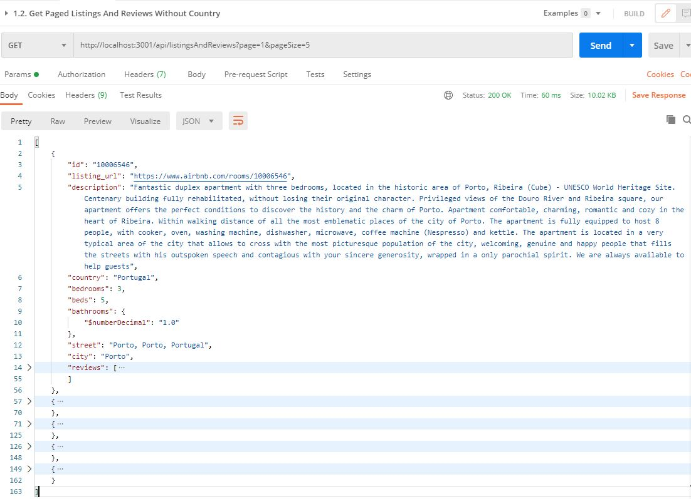
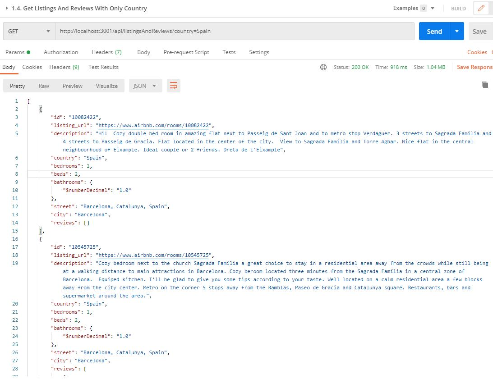
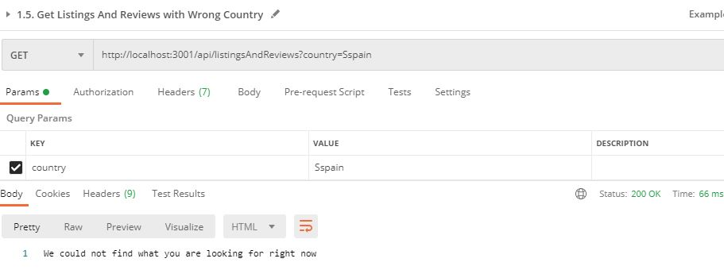
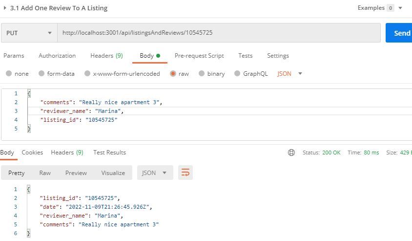

# Table of Contents
1. [Solution structure](#structure)
2. [URI design](#design)
3. [Steps to set up the MongoDB database](#mongodb)
4. [Steps to install and start the api](#steps)
5. [How to switch between mock and mongoDb mode](#mode)
6. [How to test it](#howto)
7. [How to run the unit tests](#unittest)
8. [How to run the integration tests](#integrationtest)

<a name="structure"></a>
## 1. Solution structure

```
├── airbnb_bd
├── 1.rest_api_rentals
│   ├── config\test
│   ├── images
│   ├── public
│   ├── src
│   	├── common\helpers (challenge)
│   	├── common\middlewares
│   	├── common-app\models (challenge)
│   	├── console-runners
│   	├── core
│   	├── dals\listingAndReviews
│   	├── dals\user  (challenge)
│   	├── pods\listingAndReviews
│   	├── pods\security (challenge)
│   	├── app.ts
│   	├── index.ts
├── .babelrc
├── .editorconfig
├── .env
├── .env.test
├── .gitignore
├── .create-dev-env.sh
├── docker-compose.yml
├── global-types.d.ts
├── Listing_And_Reviews_Rest_Api_LemonCode.postman_collection.json 
├── package-lock.json
├── package.json
├── README.md
├── tsconfig.json
```

<a name="design"></a>
## 2. URI design

|HTTP Method  |  Resource | Description |
| ----------  |---------  | ------  |
|POST| `/security/login` | Login |
|GET | `/listingsAndReviews?country=Spain&page=1&pageSize=10` | Get list of listings|
|GET | `/listingsAndReviews/:id`|Get a listing |
|PUT| `/listingsAndReviews/:id/reviews` | Add a review |
|PUT| `/listingsAndReviews/:id` | Update a listing and/or its reviews |
|POST| `/listingsAndReviews` | Insert a listing and/or its reviews |

<a name="mongodb"></a>
## 3. Steps to set up the MongoDB database

1. Restore an airbnb database to your Docker container that runs the Mongo image

   To restore an airbnb MongoDb database sample collection that is located in the root directory of this repository called "airbnb_bd" you would need to run the following commands:
      * `cd src`
      * `npm run start:console-runners`
   
      Then you need to select `seed-data` and enter the following information:

      * Seed data path: `../airbnb_bd` 
         * Path in your file system
      * Docker container name: `listings-and-reviews-db`
         * You can see this name in docker-compose.yml file
      * Database name: `airbnb`
         * You can see this name in .env.example or .env files

      Console logs
      ```
      docker cp "../airbnb_bd" listings-and-reviews-db:/opt/app
      docker exec listings-and-reviews-db mongorestore --db airbnb /opt/app
      ```
      
            
   * To Make sure `airbnb` database has been created properly, open MongoDB Compass and enter the following connection string: `mongodb://localhost:27017`

      

   * Please, remember to check whether there are any previous backups in opt/app that you would need to delete. And check whether the container already exists and you would need to remove it: `docker rm /listings-and-reviews-db`
   * Note that you could also find the above airbnb sample [here](https://www.mongodb.com/docs/atlas/sample-data/).
   * You could also find the above instructions [here](https://www.lemoncode.tv/curso/docker-y-mongodb/leccion/restaurando-backup-mongodb).
     
3. Create users in database

   In order to insert some users in to your Docker container that runs the Mongo image, you need to run the following command: `npm run start:console-runners`. Then you need to select `create-users`.

   

<a name="steps"></a>
## 4. Steps to install and start the api

* Install app: 
  * `cd rest_api_rentals/`
  * `npm install`

* Run app: `npm start`

<a name="mode"></a>
## 5. How to switch between mock and mongoDb mode

### Mock Mode 
Make sure the API_MOCK environment variable is `true` in the `.env` file in the root directory of this project: `API_MOCK=true`

### MongoDb Mode
`API_MOCK=false`

Note that if `.env` file does not exist, the create-dev-env.sh script will create it from `.env.example` file.

<a name="howto"></a>
## 6. How to test it
To create the requests for the end points we could use Postman or similar app.

You can find the Postman requests collection [here](Listing_And_Reviews_Rest_Api_LemonCode.postman_collection.json).

* Request to login an "Admin" user. This user can use all the end points:
   * URL: `POST http://localhost:3001/api/security/login`
   * BODY:
      ```
      {
	      "email": "admin@email.com",
	      "password": "test"
      }
      ```
   The login workflow is implemented using JWT stored in a cookie.

   We should install Postman interceptor to check cookies on postman. With cookies we could check it on browser too.

   
   
   What is cookies in response?
   The response cookie are the cookies that you want to place in the browser. The next connection from the browser that accepted the cookie from the response object will provide the cookie in the request object.
   >> Headers
      Authorization: Bearer my-token
   
   Check [jwt](https://jwt.io) information:
   
 
* Request to login an "Standard" user. This user can use all the end points except the update and insert of a listing:
   * URL: `POST http://localhost:3001/api/security/login`
   * BODY:
      ```
      {
	      "email": "user@email.com",
	      "password": "test"
      }
      ```
 
* Requests to get a list of houses with the country as an optional filter. These requests can be used by either an Standard or Admin user:

   * Get the first page of houses located in Spain. The maximum number of houses per each page are 10
     * URL: `GET http://localhost:3001/api/listingsAndReviews?country=Spain&page=1&pageSize=10`
     * Postman request and response:
     
   
   * Get the first page of houses no matter where they are located
     * URL: `GET http://localhost:3001/api/listingsAndReviews?page=1&pageSize=10`
     * Postman request and response:
     

   * Get all the houses no matter where they are located
      * URL: `http://localhost:3001/api/listingsAndReviews`
      * Postman request and response:
      

   * Get all the houses located in Spain
     * URL: `GET http://localhost:3001/api/listingsAndReviews?country=Spain`
     * Postman request and response:
     

   * Get all the houses given a wrong country, like sSpain
     * URL: `GET http://localhost:3001/api/listingsAndReviews?country=sSpain`
     * Postman request and response:
     

* Request to get the details of an existing house:
   * URL: `GET http://localhost:3001/api/listingsAndReviews/10545725`
      
   
* Request to get the details of a non existing house:
   * URL: `GET http://localhost:3001/api/listingsAndReviews/000`
   * Postman request and response:
   

* Request to add a new review for the "10545725" listing. This request can be used by either an Standard or Admin user:
   * URL: `PUT http://localhost:3001/api/listingsAndReviews/10545725/reviews`
   * BODY:
      ```
      {
         "comments": "Really nice apartment 3",
         "reviewer_name": "Marina",
         "listing_id": "10545725"
      }
      ```
      Response:
      
      
      The date has been created automatically. In the following picture you can see that the review has been added into 10545725 listing and it's displayed the first one because is the newest one.   
      

* Request to update an existing house, e.g. "10082422". This request can be used only by an Admin user:
   * URL: `PUT http://localhost:3001/api/listingsAndReviews/10545725`
   * BODY:
      ```
      {
         "id": "10082422",
         "listing_url": "https://www.airbnb.com/rooms/10082422",
         "description": "Update - Hi!  Cozy double bed room in amazing flat next to Passeig de Sant Joan and to metro stop Verdaguer. 3 streets to Sagrada Familia and 4 streets to Passeig de Gracia. Flat located in the center of the city.  View to Sagrada Familia and Torre Agbar. Nice flat in the central neighboorhood of Eixample. Ideal couple or 2 friends. Dreta de l'Eixample",
         "country": "Spain",
         "bedrooms": 1,
         "beds": 2,
         "bathrooms": 1,
         "street": "Update - Barcelona, Catalunya, Spain",
         "city": "Barcelona",
         "reviews": [
            {           
                  "reviewer_name": "Marta",
                  "comments": "Nice apartment",
                  "listing_id": "10082422"
            }
         ]
      }
      ```
      Response:
      

      In the following picture you can see that the listing has been updated and one review has been added too.   
      
      
      If an standard user tries to update a listing, the api will not allow to update it, and the response will be "Forbiden" (403).
       
       
* Request to insert a house. This request can be used only by an Admin user:
   * URL: `POST http://localhost:3001/api/listingsAndReviews`
   * BODY:
      ```
      {
         "id": "10545726",
         "listing_url": "new url",
         "description": "new description",
         "country": "Spain",
         "bedrooms": 1,
         "beds": 1,
         "bathrooms": 1,
         "street": "street",
         "city": "Cuenca",
         "reviews": [
            {           
                  "reviewer_name": "Monica",
                  "comments": "New Very Nice flat",
                  "listing_id": "10545726"
            }
         ]
      }
      ```
      Response:
      

Here, you can see some of the requests made:


<a name="unittest"></a>
## 7. How to run the unit tests

I've used Jest Framework to add unit tests of the `listingAnReviews.mappers.ts` file. 

### Debugging Jest
Since jest is a nodejs process, you could use the integrated JavaScript Debug Terminal provided by VS Code.

You could run all specs as single run in this terminal and adding some breakpoints with this command: `npm test`

Run unit tests in watch mode:

```
npm run test:watch
npm run test:watch listingAndReviews.mappers
```

<a name="integrationtest"></a>
## 8. How to run the integration tests
I've used Supertest to add integration tests of the `listingAndReviews.rest-api.ts` file. I have added integration test of these two endpoints:
* Get a list of houses with the country as an optional filter
* Get the details of a house

Supertest needs the app express instance to do a mock request. The `.env.test` file is a custom environment file for tests:
```
NODE_ENV=development
PORT=3001
STATIC_FILES_PATH=../public
CORS_ORIGIN=*
CORS_METHODS=GET,POST,PUT,DELETE
API_MOCK=true
MONGODB_URI=mongodb://localhost:27017/airbnb
AUTH_SECRET=MY_AUTH_SECRET
```

Run integration tests in watch mode:
`npm run test:watch listingAndReviews.rest-api`

To test this implementation with a MongoDB memory database, please have a look [here](https://github.com/Lemoncode/bootcamp-backend/tree/main/00-stack-documental/04-rest-api/07-testing/06-integration-tests).
